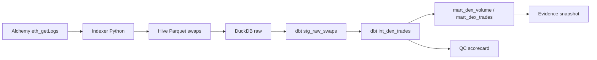

# dex-trades-canonical

**Raw fragmented DEX Swap events → canonical `dex.trades` → maintainable dbt SQL →
auditable quality labels → metric-impact scorecard.**

Semantic financial abstraction over Uniswap V2/V3 (and forks) on **Ethereum, Base,
Arbitrum, and Avalanche**, with dust and same-tx self-churn flags that stay in the
table (filterable, not deleted). Runnable locally with `uv` or in **Docker**.



## Research / QC framing

This repo is the **labeling rubric** piece of the portfolio: design quality labels,
keep them auditable, and measure whether they improve metric reliability.

| Concern | How this repo answers it |
|---|---|
| Realistic task | Multi-chain Swap logs → one canonical trade grain |
| Reliable rubric | Documented `is_dust` / `is_self_churn` rules, mirrored in Python + dbt |
| Useful trajectories | Retained flags (not deleted rows) so analysts can audit filter impact |
| Validation loop | Label distribution, clean-vs-total volume delta, dust-threshold sensitivity → scorecard |
| ML signal | Rubric-vs-model on noise + orderflow_interesting → `artifacts/ml_*.md` |
| Market structure | MEV-lite proxies + hypothesis memo → [RESEARCH.md](RESEARCH.md) |

### Market structure / MEV-lite

Auditable proxies (not sandwich proof): multi-swap txs, same-block pool bursts, and
A→B→A sandwich-leg heuristics. Flags stay on the row for filtering.

```bash
make research   # → artifacts/research_orderflow.md
```

See [RESEARCH.md](RESEARCH.md) for hypothesis → evidence → product implications
(including what you'd measure next for networking / inclusion delay).

### ML (rubric vs model)

Train classifiers on weak labels (noise and orderflow_interesting) and measure holdout
agreement. Models **complement** the rubric; they do not replace retained flags.

```bash
make ml   # → artifacts/ml_label_report.md + ml_orderflow_report.md
```

Also maps cleanly to Allium-style `dex.trades` interview expectations (see below).
Sibling stories: [crypto-market-elt](https://github.com/marioespinosaperales/crypto-market-elt) (ingestion contracts) and [lp-history-reconstructor](https://github.com/marioespinosaperales/lp-history-reconstructor) (ground-truth eval).

## Allium gap mapping

| Gap | How this repo answers |
|---|---|
| Semantic gap | One grain: `(chain, tx_hash, log_index)` → sold/bought, human amounts, pool price |
| Standardization | Same schema for V2 and V3 across Eth / Base / Arbitrum / Avalanche |
| Infra / maintainability | Config YAML + pydantic, chunked RPC, Hive Parquet, dbt staging → marts, Docker |
| Accountability | Documented dust + self-churn rules; flags retained for audit; QC scorecard |

## Scope (v1)

- Chains: Ethereum + Base + Arbitrum + Avalanche (Alchemy HTTPS)
- Protocols: Uniswap V2/V3 + native DEXes (Camelot, Aerodrome Slipstream, Pharaoh)
- Output: `int_dex_trades` / `mart_dex_trades` + `mart_dex_volume_by_protocol`
- Out of v1: Solana, Curve, lending.liquidations, full factory discovery

**Next:** Solana / Curve with the same `dex.trades` schema (`chain × protocol × pool`).

## Canonical columns

Grain: one row per Swap log.

- Identity: `chain`, `chain_id`, `protocol`, `pool` (e.g. `USDC/WETH`), `pool_address`, `block_number`, `block_time` (nullable), `tx_hash`, `log_index`
- Economics: `trader`, `token_sold`, `token_bought`, `amount_sold`, `amount_bought`, raw counterparts
- Price/volume: `price_token1_per_token0`, `volume_token0`, `volume_quote_stable` (USDC-as-quote when configured)
- Quality: `is_dust`, `is_self_churn`, `is_clean`

## Methodology: noise filters

### `is_dust`

A trade is dust when either:

1. The pool is stable-quoted and `volume_quote_stable` &lt; `$1` (configurable `dust_usdc_threshold`), or
2. Both human amounts are below `1e-6` (`dust_token_threshold`)

### `is_self_churn`

Same `tx_hash` has ≥2 swaps on the **same pool** for the **same trader** with reverse directions (`0_to_1` and `1_to_0`). Simple wash / router round-trip proxy — not a full MEV classifier.

### `is_clean`

`not is_dust and not is_self_churn`. Volume marts expose both total and clean aggregates.

The same rubric is executable in Python (`src/dex_trades/evals/labels.py`) for unit tests
and the QC scorecard, so dbt and pytest cannot silently drift.

## Quickstart

```bash
uv sync
cp .env.example .env   # set DEX_ETH_RPC_URL and DEX_BASE_RPC_URL

make backfill          # index lookback (~5k blocks) per pool
make transform         # DuckDB load + dbt build
make snapshot          # Evidence DuckDB under dashboard/sources/dex/
make eval              # QC scorecard → artifacts/qc_scorecard.md
make research          # orderflow / MEV-lite research report
make ml                # noise + orderflow ML holdout reports

make lint && make test
```

Score the golden fixture without a warehouse / RPC:

```bash
uv run python -m dex_trades.evals --fixture-only
```

**Docker:**

```bash
make docker-build
make docker-pipeline   # needs .env with Alchemy URLs
make docker-test       # pytest + fixture scorecard inside the image
```

Alchemy Free: `chunk_size: 10` (same `eth_getLogs` cap as sibling LP repo).

## Default pools

| Chain | Protocol | Pair | Address |
|---|---|---|---|
| Ethereum | V3 0.05% | USDC/WETH | `0x88e6A0c2dDD26FEEb64F039a2c41296FcB3f5640` |
| Ethereum | V2 | USDC/WETH | `0xB4e16d0168e52d35CaCD2c6185b44281Ec28C9Dc` |
| Base | V3 0.05% | WETH/USDC | `0xd0b53D9277642d899DF5C87A3966A349A798F224` |
| Arbitrum | Uniswap V3 0.05% | WETH/USDC | `0xC6962004f452be9203591991d15f6b388e09E8D0` |
| Arbitrum | Camelot V3 | WETH/USDC | `0xb1026b8e7276e7ac75410f1fcbbe21796e8f7526` |
| Avalanche | Uniswap V3 0.05% | WAVAX/USDC | `0xfAe3f424a0a47706811521E3ee268f00cFb5c45E` |
| Avalanche | Pharaoh V3 | WAVAX/USDC | `0xf01449C0bA930B6e2CaCA3DEF3CCBd7a3E589534` |
| Base | Aerodrome Slipstream | WETH/USDC | `0xb2cc224c1c9fee385f8ad6a55b4d94e92359dc59` |

## Repository layout

```
config/           chains, pools, pipeline (YAML; secrets via DEX_ env)
src/dex_trades/   RPC, V2/V3 Swap decode, backfill, Parquet, DuckDB
src/…/evals/      labeling rubric + QC scorecard (distribution, volume impact, threshold sweep)
src/…/ml/         rubric-vs-model noise classifier + holdout metrics
dbt/              stg → int_dex_trades → volume marts + tests
dashboard/        Evidence over marts snapshot
tests/            real-shaped Swap fixtures + golden_trades.json + noise unit tests
Dockerfile        reproducible Linux image (uv + pipeline)
```

## Portfolio

Sibling projects:

- [crypto-market-elt](https://github.com/marioespinosaperales/crypto-market-elt) — ingestion contracts + fail-fast QC
- [lp-history-reconstructor](https://github.com/marioespinosaperales/lp-history-reconstructor) — LP event sourcing + ground-truth verify
